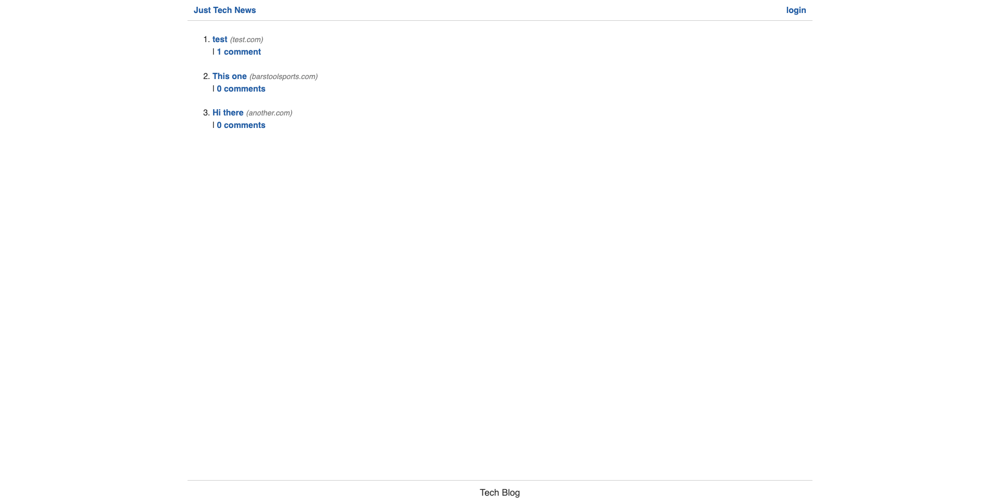

# Tech News

## Table of Contents

* [Description](#description)
* [Deployment](#deployment)
* [License](#license)
* [Questions](#questions)
## Description
A full stack application where users can create an account and use it to create posts and comments
## Screenshot

## Deployment
https://infinite-oasis-16709.herokuapp.com/

## Installation

To run this application, please do the following installation:

`
npm i
`

## License

This application is covered under the MIT license.
## Questions

Email for any questions at [Andrew Durham: andrewdurham1094@gmail.com](mailto:andrewdurham1094@gmail.com).